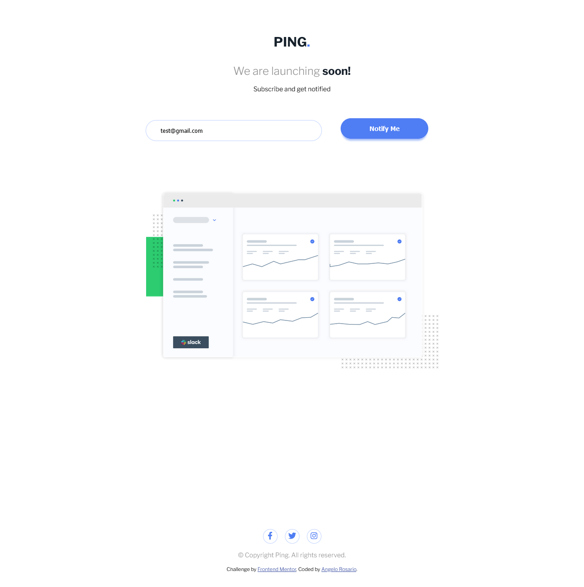

# Frontend Mentor - Ping coming soon page solution

This is a solution to the [Ping coming soon page challenge on Frontend Mentor](https://www.frontendmentor.io/challenges/ping-single-column-coming-soon-page-5cadd051fec04111f7b848da). Frontend Mentor challenges help you improve your coding skills by building realistic projects. 

## Table of contents

- [Overview](#overview)
  - [The challenge](#the-challenge)
  - [Screenshot](#screenshot)
  - [Links](#links)
- [My process](#my-process)
  - [Built with](#built-with)
  - [What I learned](#what-i-learned)
  - [Continued development](#continued-development)
- [Author](#author)


## Overview

### The challenge

Users should be able to:

- View the optimal layout for the site depending on their device's screen size
- See hover states for all interactive elements on the page
- Submit their email address using an `input` field
- Receive an error message when the `form` is submitted if:
	- The `input` field is empty. The message for this error should say *"Whoops! It looks like you forgot to add your email"*
	- The email address is not formatted correctly (i.e. a correct email address should have this structure: `name@host.tld`). The message for this error should say *"Please provide a valid email address"*

### Screenshot




### Links

- Solution URL: [GitHub](https://github.com/Sengsith/ping-page)
- Live Site URL: [Netlify](https://heroic-speculoos-3ff758.netlify.app)

## My process

My main goal for completing this project was to see how fast I could write my CSS with roughly the same amount of time I usually spend working on these projects. I'm proud of how this ended up looking. My main work flow is taking some time to analyze what the design will entail, writing up custom properties, html, javascript, and then finishing up with the CSS. I am starting to understand basic concepts of CSS and am happy to see this much improvement from my first  project.

### Built with

- Semantic HTML5 markup
- CSS custom properties
- Flexbox
- CSS Grid
- Mobile-first workflow


### What I learned

One new thing I learned was using CSS variables inside my javascript. 

```js
const paleBlue = getComputedStyle(document.documentElement).getPropertyValue("--clr-secondary-paleblue");
inputElement.addEventListener('keypress', (e) => {
  errorStyle.display = "none";
  inputStyle.outline = "1px solid " + paleBlue;
})
```

Since custom properties are a part of style, they are a part of computed style, so we can use the function getComputedStyle.

### Continued development

This will be my last Newbie challenge to complete before I move on to Junior challenges. There were moments where I was stuck trying to juggle my main flexbox within a few containers but it is all starting to make more sense in my head the more I work on challenges.

## Author

- Frontend Mentor - [@Sengsith](https://www.frontendmentor.io/profile/Sengsith)
